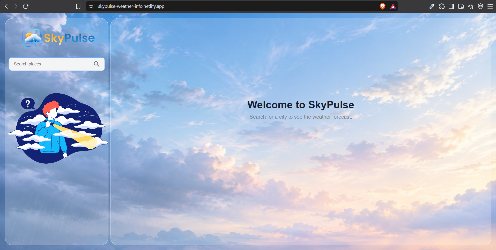
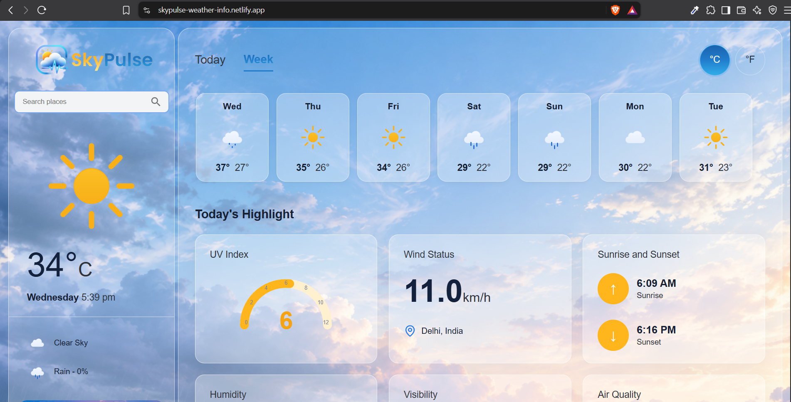
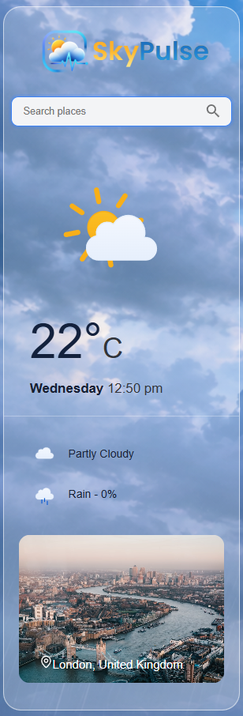
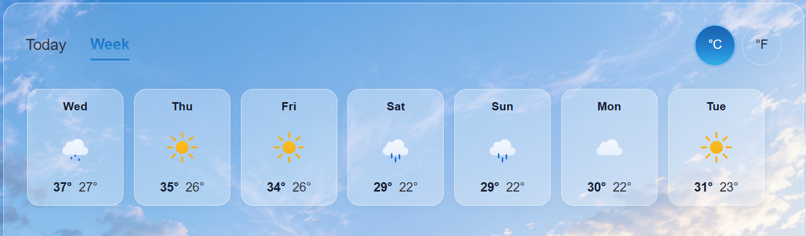
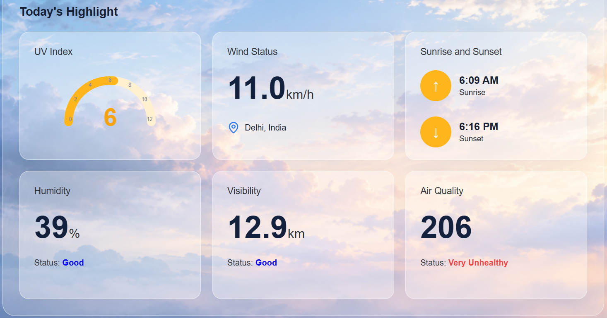
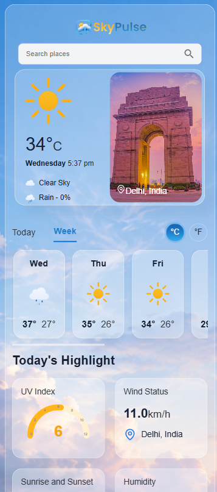

# 🌤️ SkyPulse — Modern Weather Application

<p align="center">
  <strong>A modern and responsive weather application built with React.</strong>
</p>

<p align="center">
  Search any city and explore current weather conditions, hourly forecasts, weekly forecasts, and detailed weather highlights through a clean and interactive interface.
</p>

<p align="center">
  <a href="https://skypulse-weather-info.netlify.app/">
    <strong>🌐 Live Demo</strong>
  </a>
</p>

---

## 📸 Preview

### Home/Default Preview



### Searched Preview



### Current Weather

<p align="center">
 
</p>

### Forecast



### Weather Highlights



### Responsive Mobile View

<p align="center">
  
</p>

---

## ✨ Features

* 🌍 Search weather by city
* 🌡️ Display current temperature and weather conditions
* 🌤️ Dynamic weather icons
* 🏙️ Dynamic city images
* 🕐 Hourly weather forecast
* 📅 Weekly weather forecast
* ☀️ UV Index information
* 💨 Wind information
* 💧 Humidity information
* 👁️ Visibility information
* 🌫️ Air quality information
* 📱 Responsive design for desktop, tablet, and mobile
* 🎨 Modern glassmorphism-inspired user interface
* ⚡ Fast and interactive React-based UI

---

## 🛠️ Tech Stack

### Frontend

* React
* JavaScript
* HTML5
* CSS3
* Vite

### UI & Icons

* Material UI
* Lucide React

### APIs

* Weather API
* Unsplash API for dynamic city imagery

### Deployment

* GitHub
* Netlify

---

## 🧩 Project Structure

```text
SkyPulse/
│
├── public/
│
├── screenshots/
│   ├── home.png
│   ├── current-weather.png
│   ├── forecast.png
│   ├── highlights.png
│   └── mobile.png
│
├── src/
│   │
│   ├── assets/
│   │   ├── fonts/
│   │   ├── weather-icons/
│   │   └── demo-images/
│   │
│   ├── components/
│   │   ├── Nav.jsx
│   │   ├── SearchBar.jsx
│   │   ├── CityCard.jsx
│   │   ├── CurrentWeather.jsx
│   │   ├── Forecast.jsx
│   │   ├── HourlyForecast.jsx
│   │   ├── WeeklyForecast.jsx
│   │   ├── UVIndex.jsx
│   │   └── ...
│   │
│   ├── App.jsx
│   ├── App.css
│   └── main.jsx
│
├── .gitignore
├── index.html
├── package.json
└── README.md
```

---

## 🚀 Getting Started

Follow these steps to run SkyPulse locally.

### 1. Clone the repository

```bash
git clone https://github.com/YOUR_USERNAME/SkyPulse.git
```

### 2. Navigate into the project

```bash
cd SkyPulse
```

### 3. Install dependencies

```bash
npm install
```

### 4. Configure environment variables

Create a `.env` file in the project root:

```env
VITE_WEATHER_API_KEY=your_weather_api_key
VITE_UNSPLASH_ACCESS_KEY=your_unsplash_access_key
```

Replace the placeholder values with your API keys.

> Never commit your `.env` file to GitHub.

### 5. Start the development server

```bash
npm run dev
```

The application will be available at the local URL provided by Vite.

---

## 🔑 Environment Variables

SkyPulse uses environment variables for API configuration.

| Variable                   | Description                           |
| -------------------------- | ------------------------------------- |
| `VITE_WEATHER_API_KEY`     | API key used to retrieve weather data |
| `VITE_UNSPLASH_ACCESS_KEY` | API key used to retrieve city images  |

Make sure `.env` is included in `.gitignore`.

---

## 🌐 Live Demo

**Live Website:**
https://skypulse-weather-info.netlify.app/

**Source Code:**
https://github.com/Aniket-MCA/SkyPulse

---

## 📱 Responsive Design

SkyPulse is designed to work across different screen sizes.

The interface adapts to:

* 💻 Desktop
* 📱 Mobile
* 📟 Tablet

The layout, weather cards, forecasts, typography, and spacing adjust according to the available screen size.

---

## 🎯 Project Goals

The main goal of SkyPulse was to build a modern weather application while practicing:

* React component architecture
* API integration
* Asynchronous JavaScript
* State management
* Responsive CSS
* Reusable components
* API error handling
* Environment variables
* Production deployment
* Git and GitHub workflow

---

## 📚 What I Learned

Through this project, I worked with:

* React functional components
* React hooks such as `useState`
* API requests using `fetch`
* Handling asynchronous data
* Conditional rendering
* Passing data through props
* Responsive layouts using CSS media queries
* Environment variables with Vite
* Working with external APIs
* Production builds using Vite
* Git version control
* Deployment using Netlify

---

## 🔮 Future Improvements

Potential improvements for future versions include:

* 📍 Automatic location detection
* ⭐ Favorite cities
* 🌙 Dark/light theme
* 🌡️ More weather metrics
* 📊 Weather charts
* 🔔 Weather alerts

---

## 👨‍💻 Author

**Aniket Sharma**

* GitHub: `https://github.com/Aniket-MCA`
* LinkedIn: `www.linkedin.com/in/aniket-sharma-0576b8339`

---

## 📄 License

This project is created for learning and portfolio purposes.
